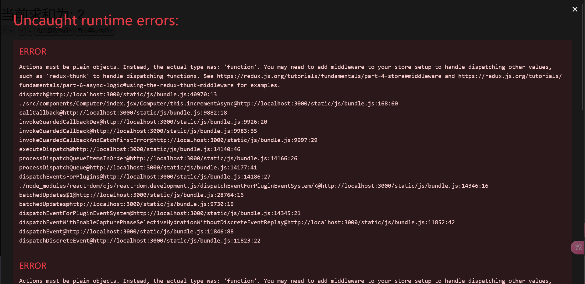

p99 求和案例react版
冷知识：.gitignore文件是用来告诉Git不应该跟踪的文件或目录;react项目中因为node_modules文件夹内部分文件比较大，而且涉及到不同版本不同环境，因此不需要上传到代码仓库，推荐直接在.gitignore文件中添加node_modules，每次拉取代码到新环境只需要执行npm install即可自动下载对应的依赖

p100 求和案例redux 迷你版(本版本没有Action Creators)
必要的组件：store、reducer + npm install redux react-redux
注意：每一个组件都有一个reducer

冷知识：默认暴露一般只暴露一次 暴露一个东西 而store.js就非常适合默认暴露 即 export default store

1、创建store
import { createStore as createStore} from 'redux' 中createStore已经被弃用，
所以使用：import { legacy_createStore as createStore} from 'redux'
或者 configureStore

2、创建reducer
冷知识：import {xxx} from xxx 与 import xxx from xxx 的区别：前者支持统一或分别暴露的形式 而后者表示默认暴露的形式
但是reducer一般使用默认暴露，其比较专一地对一个东西进行服务，有着一对一的关系；详见store.js中的引入方式

reducer不管细节的事情，只处理最为直接的操作，其他逻辑如异步操作判断、传入参数的判断等，最好在组件中就判断好了再告诉reducer进行处理执行

可以说reducer比较纯粹

3、组件中的变化
因为state已经全部交给了redux管理，因此组件中的state已经名存实亡了，需要从redux的store来获取值了!

4、api1：store.getState() 获取当前的state
注意到没有使用其他任何的api，就已经初始化了state，那是因为store会自动调用一次reducer函数
computerReducer调用了 0 Object { type: "@@redux/INITv.t.g.8.z.4" }  --> 这里preState为0是因为我们使用了形参默认值，去掉后为undefined

5、改造加法，调用reducer：store.dispatch({ type: 'increment', data: parseInt(value) })
发现store的值确实变了，但是页面显示没有变化
区别分析：
使用this.setState的时候，react会自动更新组件的状态，还会重新调用一次render，从而对页面进行刷新
而Redux只是对状态进行了更新，并没有更新渲染页面的默认动作；即redux内部的状态更改默认是不会对页面进行更新的
因此需要对redux的状态进行监听，然后调用render来刷新页面

6、api2：store.subscribe(df) 监听状态的变化
store.subscribe(()=>{}) 只要redux中任何一个状态发生变化，都会执行这个回调函数

6.1 回调函数使用 this.setState({}) 虽然什么都没有，但是其会触发更新+渲染

6.2 this.forceUpdate() 强制刷新页面

6.3 上面两种需要在各个组件都使用componentDidMount()内进行store的订阅，如果组件数量很多，那么就会非常麻烦
可以直接在入口文件index.js中进行store的订阅，这样就只需要在入口文件中进行一次订阅，然后检测到redux更新之后直接挂载整个App组件，因为DOM diffing算法的存在，这样的渲染效率不会太差

总结：
（1）去除Computer组件自身的状态
（2）src下建立：
-src
 -redux
  -store.js
  -xxx_reducer.js
（3）store.js：
    1）引入redux中的createStore函数，创建一个store
    2）createStore调用的场合需要传入一个为其服务的reducer
    3）暴露store对象
（4）xxx_reducer.js：
    1）reducer的本质是一个函数，接收：preState、action 返回加工后的状态
    2）reducer有两个作用：初始化状态，加工状态
    3）reducer被第一次调用时，是store自动触发的，传递的(preState:undefined,action:{type: "@@redux/INITx.x.x.x.x"})
（5）在index.js中监测store中状态的改变，一旦发生改变重新渲染<App/>
    备注：redux只负责管理状态，至于状态的改变驱动着页面的展示，要靠程序员自己实现

p101 求和案例完整版
+ action creators  用于自动创建action对象(符合redux的初衷，不要程序员自己去创建这些action对象)
与reducer类似，各个组件都有对应的action-creator

注意到type这种写操作类型的常量值，万一写错了 很难排查，因此我们需要一个存常量值的文件来保证编码的错误率尽量低
而且如果这个常量以后需要更改名称，只需要改源头即可，非常方便！！！

小结：
新增文件：
1、computer_action.js 专门用于创建action对象
2、constant.js 放置由于编码疏忽写错action中的type；统一管理魔法值

redux进阶
p102 redux进阶之异步action
同步action 与 异步action 的区别
首先要认识到，action是js中的一般Object对象，但也可以是一个函数function
一般对象的action叫做同步action，函数类型的action叫做异步action
如果直接传递异步action给store.dispatch()，其会报错并提示以下内容：

大体内容为：Actions must be plain objects. Instead, the actual type was: 'function'. You may need to add middleware to your store setup to handle dispatching other values, such as 'redux-thunk' to handle dispatching functions
提示如果向store传递非一般对象的action对象需要使用中间件来处理
中间件的作用；当检测到传到store的action对象为非一般对象(function)的场合发动，该动作会变为执行action对象(function)函数一次

引入redux-thunk中间件 
npm i redux-thunk
thunk - 形实转换程式
接下来在store.js中引入中间件redux-thunk，使其支持异步action；其为默认暴露直接引入即可
需要在redux中引入applyMiddleware函数，并将中间件作为参数传入；整体作为第二个参数传入到createStore中

import { legacy_createStore as createStore, applyMiddleware} from 'redux'
import computerReducer from './computer_reducer'
import { thunk } from 'redux-thunk'; 
export default createStore(computerReducer, applyMiddleware(thunk))

因为store.dispatch(异步action)，而异步action一般会调用同步action，因此在这个回调函数里可以直接传dispatch，可以避免引入store.js

总结：
(1)明确：延迟的动作不想交给组件自身，想交给action
(2)何时需要异步action：想要对状态进行操作，但是具体的数据靠异步任务返回
(3)具体编码：
 1.npm i redux-thunk，并配置在store中
 2.创建action的函数不再返回一般对象，而是一个函数，该函数中写想要的异步任务；从而实现不再组件等待而是store去管理
 3.异步任务有结果后，分发一个同步的action去真正操作数据
(4)备注：异步action不是必须要写的，完全可以自己等待异步任务的结果了再去分发同步action

p103 对react-redux的理解
react与redux是不同的出版方，facebook为了简化程序员编码，将redux出了react版本，即react-redux

react-redux模型的理解：(详见图片：react-redux模型图.png)
1.所有的UI组件都应该被包裹在一个容器组件中，他们是父子关系(容器组件是父，UI组件是子)
2.容器组件是真正和redux打交道的，其可以随意的使用redux的api
3.UI组件中不能使用任何redux的api
4.容器组件会传给UI组件:
  (1)redux中所保存的状态
  (2)用于操作状态的方法
5.备注:容器给UI传递:redux的状态、redux中操作状态的方法，均通过props传递

p104 连接容器组件与UI组件
UI组件 放components中
容器组件 放container中
改造ui组件，使其中不能包含任何的redux的api，负责页面的呈现和绑定用户的事件(鼠标事件、键盘事件等)

注意到容器组件不能使用rcc快捷创建了，因为其比较复杂，需要借助react-redux来创建
npm i react-redux
容器组件是一个桥梁，链接redux与ui组件

注意到 容器组件中的store不能由程序员在代码层面引入，必须在其被调用的层级以props的形式传入相应的store

p105 react-redux的基本使用 *****
首先要明确认识到容器组件是UI组件的父组件，详见pic/02

容器组件需要借助<props参数>给UI组件传递： 1、redux中保存的状态 2、用于操作状态的方法

因为这个父子组件关系是使用connect()()来实现链接的，不能像传统方法一样使用<A><B parma1 = xxx ...><A/>来传递props参数

所以传递props的方法就是：
在connect()()第一次调用的时候需要传入两个参数，注意到这里说的第一次调用是connect()这个部分，后续的()是调用connect()返回的函数

connect(func1,func2)(XYZ)且这两个参数必须是函数
//func1函数返回的对象中的key就作为传递给UI组件props的key，value就作为传递给UI组件的props的value - 此处传的是 状态
function func1(){
  return {param1:xxx,param2:xxx,...} ~ <XYZ param1 = {param1} param2 = {param2}.../>
}

//func2函数返回的对象中的key就作为传递给UI组件props的key，value就作为传递给UI组件的props的value - 此处传的是 操作状态的方法
function func2(){
  return {increament:()=>{console.log('increament')}}
}

注意到react-redux在调用func1的场合，已经调用了store.getState函数(早在第一步容器组件中就传入了state作为props参数)
因此func1(state)可以直接接收store.getState的调用结果
//func1函数返回的对象中的key就作为传递给UI组件props的key，value就作为传递给UI组件的props的value - 此处传的是 状态
function func1(state) {
    return { sum: state }
}

现在优化func2中给到子组件用来操作状态的函数
//func2函数返回的对象中的key就作为传递给UI组件props的key，value就作为传递给UI组件的props的value - 此处传的是 操作状态的方法
function func2() {
    return {
        increment: (number) => {
            //通知redux执行加法操作
            store.dispatch({ type: INCREMENT, data: number })
        }
    }
}

//注意到func2中一定会用到store.dispatch，因此react-redux会直接将dispatch传入到func2中，故可以省略引入： import store from '../../redux/store'
function func2(dispatch) {
    return {
        increment: (number) => {
            //通知redux执行加法操作
            dispatch({ type: INCREMENT, data: number })
        }
    }
}

可以发现react-redux对func1 func2的传入值都有了很好的预先处理，但是目前还缺少一个aciton对象的creatorjs没有被很好地使用
先将func1,func2的命名官方化：mapStateToProps,mapDispatchToProps
function mapDispatchToProps(dispatch) {
    return {
        increment: (number) => {
            //通知redux执行加法操作
            dispatch(createIncrementAction(number))
        },
        decrement: (number) => {
            //通知redux执行减法操作
            dispatch(createDecrementAction(number))
        },
        incrementAsync: (number, delay) => {
            //通知redux执行异步加法操作
            dispatch(createIncrementAsycnAction(number, delay))
        }
    }
}

/**
 * 小结：核心是connect()()函数的理解
 * 1.mapStateToProps(mapDispatchToProps)函数返回的是一个对象
 * 2.返回的对象中的key就作为传递给UI组件props的key，value就作为传递给UI组件的props的value
 * 3.mapStateToprops(mapDispatchToProps)用于传递状态(传递操作状态的方法)
 * */

小结：求和案例_react-redux基本使用
(1)明确两个概念：
1、UI组件：不能使用任何redux的api，只负责页面的呈现、交互等
2、容器组件：负责和redux通信，将结果交给UI组件
(2)如何创建一个容器组件--靠react-redux的connect函数
connect(mapStateToProps, mapDispatchToProps)(UI组件)
-mapStateToProps:映射状态，返回值是一个对象
-mapDispatchToProps:映射操作状态的方法，返回值是一个对象
(3)备注：容器组件中的store是靠props传进去的，而不是在容器组件中直接引入
 

p106 优化1-简写mapDispatch
箭头函数如果参数就一个就可以不写小括号 + 箭头函数的右边函数体只有一句且就一个默认的{return 值}的形式 则可以写成一个返回的对象的形式
最后可以将所有的函数直接将箭头函数的()=>{}部分丢入到connect()的参数中，使得整体容器组件更加袖珍简洁
类似与下面这个效果：
export default connect(
    state => ({ sum: state }), 
    dispatch => ({
        increment: number => dispatch(createIncrementAction(number)),
        decrement: number => dispatch(createDecrementAction(number)),
        incrementAsync: (number, delay) => dispatch(createIncrementAsycnAction(number, delay)),
    })
)(ComputerUI)

mapDispatchToProps的一般写法：
dispatch => ({
    increment: number => dispatch(createIncrementAction(number)),
    decrement: number => dispatch(createDecrementAction(number)),
    incrementAsync: (number, delay) => dispatch(createIncrementAsycnAction(number, delay)),
})
其还可以优化为一个对象的写法：
因为调用this.props.increment的场合，实际上会携带对应的参数调用createIncrementAction；
至此会返回一个action对象，而react-redux经过优化会自动识别到action对象后，自动dispatch该action对象!!!!!
{
  increment:createIncrementAction,
  decrement:createDecrementAction,
  incrementAsync:createIncrementAsycnAction
}
所以说connect()中传入的第二个参数可以是一个函数 也可以是一个对象，如果是对象，则会自动将其中的函数映射到props上，并自动dispatch该函数的返回值
小结：求和案例_react-redux基本使用
(4)备注ex: mapDispatchToProps也可以是一个对象，
函数的情况下，程序员自己写dispatch
对象的情况下，react-redux检测到返回值是一个action对象时，会自动调用dispatch

p107 优化2-Provider组件的使用
1、在使用了react-redux的情况下，不再需要使用store.subscribe()方法来监听redux的状态变化;那是因为直接在容器组件中使用connect()方法来订阅redux的状态变化
2、容器组件中的store是作为props参数在App.js中传入的，如果有1e个容器组件我就要写1e次props吗？
-当然不需要，可以使用Provider组件来统一管理store，只需要在入口文件index.js中引入Provider组件，并将store作为props参数传入即可！！！
import { Provider } from 'react-redux';
把所有容器组件都需要的store传入Provider，那之后Provider会自动分析整个应用所有的容器组件，把store精准地传入所有需要store的容器组件；
const root = ReactDOM.createRoot(document.getElementById('root'));
root.render(<App/>);
\ 初版
const root = ReactDOM.createRoot(document.getElementById('root'));
root.render(<Provider store={store}><App/></Provider>);
\ AI提示的简写版：但是好像用不了！！！
const root = ReactDOM.createRoot(document.getElementById('root'));
root.render(Provider(<App/>, store));

因此不使用rcc来写容器组件的原因就是react-redux中提供了connect等很多功能，能够简化许多代码的编写，有很多预先定义的API与遍历设置

p108 优化3-整合UI组件与容器组件
redux版： 组件 + redux
react-redux版： 组件{容器组件+UI组件} + redux
可以发现这样的redux->react-redux的切换，会使得组件从1一个变为2个(组件->容器组件+UI组件)
如果使用redux的组件多起来了，那么这个1变2的过程就会非常繁琐，工作量成倍增加，因此现在需要将容器组价和UI组件整合合并起来
也就是说react-redux虽然要求要有两类组件，但是没有规定这两个组件必须写为两个文件，现在可以将一套容器UI写在一个js中

因为最终要暴露的肯定是外层的容器组件，因此将UI组件放到容器组件中，优化暴露的组件数、引用情况以及函数名称等等
大致结构见pic/03_容器融合UI.png

优化的总结：
1、容器组件和UI组件整合为一个文件
2、无需自己给容器组件传递store，给<App/>包裹一个<Provider store={store}>即可
3、使用了react-redux后也不用自己检测redux中状态的改变了，容器组件可以自动完成这个工作
4、mapDispatchToProps也可以简单的写成一个对象
5、一个组件要和redux交互需要经过的步骤：
- 1、定义好UI组件---不暴露
- 2、引入connect生成一个容器组件，并暴露，写法如下：
    connect(
        state=>({key:value}),   //映射状态
        {key1:actionCreator1,key2:actionCreator2,...}   //映射操作状态的方法}
    )(UI组件)
- 3、在UI组件中通过this.props.xxx来读取状态、使用操作状态的方法

p109 数据共享-编写Person组件
首先将action_creator、reducer进行分文件夹存储；由于constant与store是通用的仅有一个，所以不做额外处理

p110 数据共享-编写Person组件的reducer
注意传入对象与修改对象的方式即可

p111 数据共享-完成数据共享收尾
1、当redux为多个组件服务的场合，其存储的state将是一个键值对的对象来储存
2、当有多个reducer的场合需要使用combineReducers来合并reducer
const allReducers = combineReducers({
    stateValueName1: reducer1,
    stateValueName2: reducer2,
   ...
})

p112 纯函数